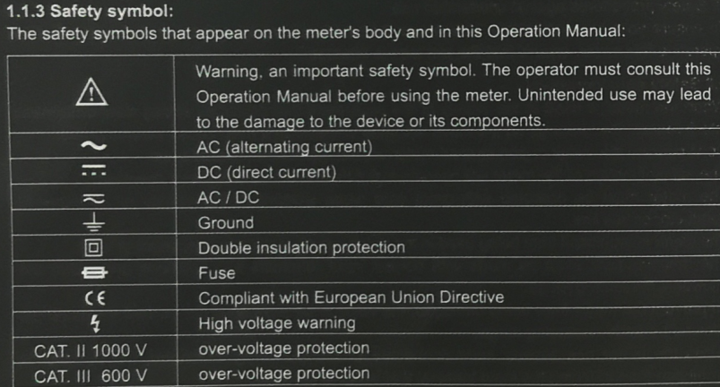
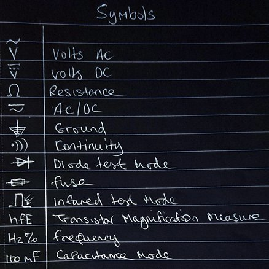
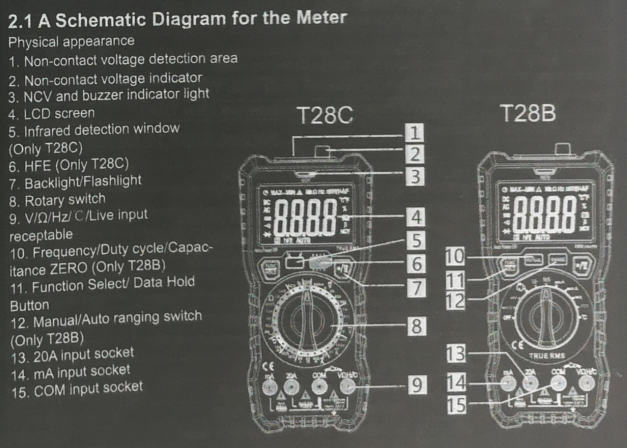

 

 

 

**Safety Symbols:**

-   **Warning Triangle:** This indicates a general warning and advises the user to consult the manual before using the meter.
-   **CE Marking:** This symbol signifies that the product complies with European Union directives, ensuring it meets specific safety, health, and environmental requirements.^1^
-   **High Voltage Symbol:** This warns of the presence of high voltage, which can be dangerous if not handled correctly.^2^

**Electrical Symbols:**

-   **AC Symbol:** This represents alternating current where the direction of the current flow changes periodically.
<iframe width="1198" height="522" src="https://www.youtube.com/embed/5kfwIbepods" title="Alternating Current Explained" frameborder="0" allow="accelerometer; autoplay; clipboard-write; encrypted-media; gyroscope; picture-in-picture; web-share" referrerpolicy="strict-origin-when-cross-origin" allowfullscreen></iframe>

  
-   **DC Symbol:** This represents direct current, where the current flows in a single direction.^4^
-   **Ground Symbol:** This indicates the ground connection, which is essential for safety and proper operation of the device.
-   **Double Insulation Symbol:** This indicates that the device has double insulation, providing additional protection against electric shock.^6^

**Other Symbols:**

-   **Fuse Symbol:** This indicates the presence of a fuse, which is a safety device that can interrupt the flow of current in case of an overload or short circuit.

I hope this helps! Let me know if you have any other questions.

#lovrum #multimeters #symbols #schematics #safety #electrical #ac-current #dc-current 